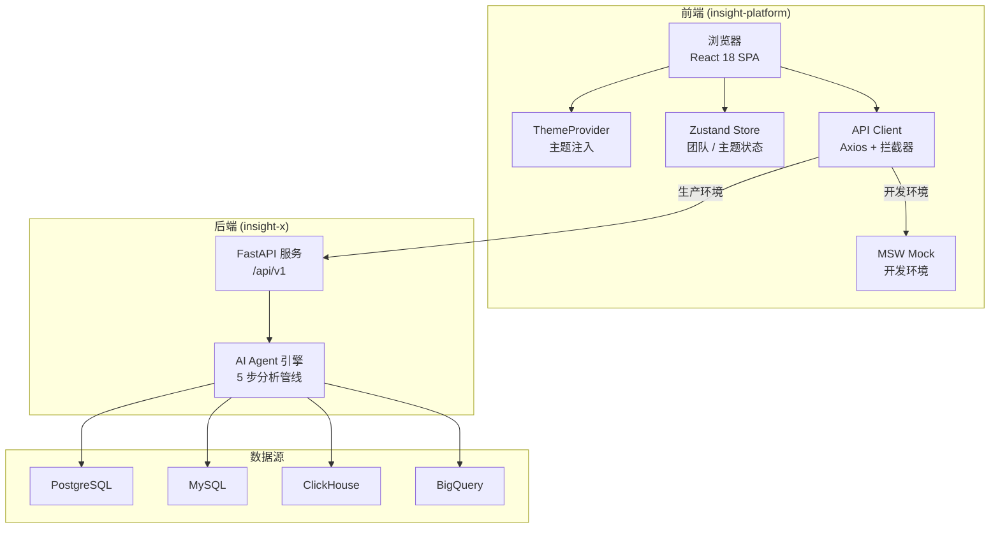
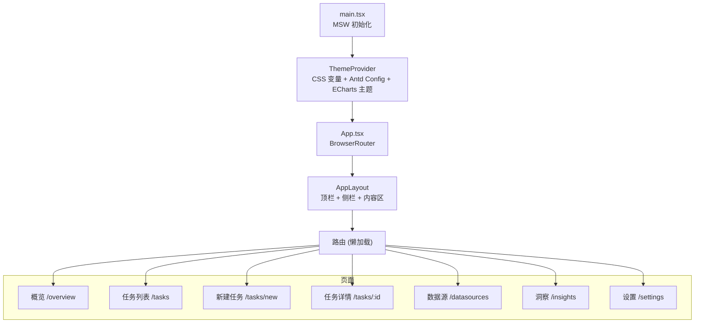
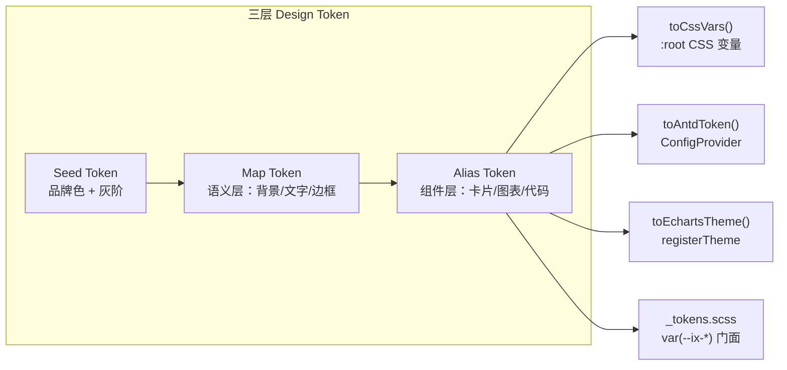
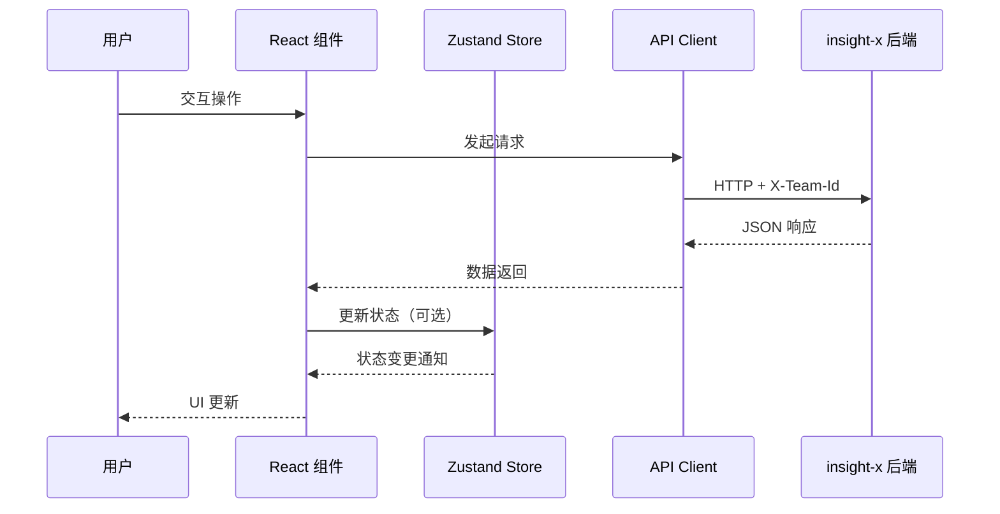

# 系统架构

## 整体架构

Insight 洞察分析平台采用经典的三层架构，前端 SPA 通过 RESTful API 与后端 AI Agent 交互，后端连接多种数据源执行分析任务。

```mermaid
graph TB
    subgraph Frontend["前端 (insight-platform)"]
        Browser["浏览器<br/>React 18 SPA"]
        ThemeProvider["ThemeProvider<br/>主题注入"]
        Store["Zustand Store<br/>团队 / 主题状态"]
        APIClient["API Client<br/>Axios + 拦截器"]
        MSW["MSW Mock<br/>开发环境"]
    end

    subgraph Backend["后端 (insight-x)"]
        API["FastAPI 服务<br/>/api/v1"]
        Agent["AI Agent 引擎<br/>5 步分析管线"]
    end

    subgraph DataSources["数据源"]
        PG["PostgreSQL"]
        MySQL["MySQL"]
        CH["ClickHouse"]
        BQ["BigQuery"]
    end

    Browser --> ThemeProvider
    Browser --> Store
    Browser --> APIClient
    APIClient -->|开发环境| MSW
    APIClient -->|生产环境| API
    API --> Agent
    Agent --> PG & MySQL & CH & BQ
```

## 前端内部架构

```mermaid
graph TB
    Main["main.tsx<br/>MSW 初始化"]
    ThemeProv["ThemeProvider<br/>CSS 变量 + Antd Config + ECharts 主题"]
    App["App.tsx<br/>BrowserRouter"]
    Layout["AppLayout<br/>顶栏 + 侧栏 + 内容区"]
    R["路由 (懒加载)"]

    Main --> ThemeProv --> App --> Layout --> R

    subgraph Pages["页面"]
        Overview["概览 /overview"]
        Tasks["任务列表 /tasks"]
        NewTask["新建任务 /tasks/new"]
        Detail["任务详情 /tasks/:id"]
        DS["数据源 /datasources"]
        Insights["洞察 /insights"]
        Settings["设置 /settings"]
    end

    R --> Overview & Tasks & NewTask & Detail & DS & Insights & Settings
```

## 主题管线

四套主题（晨曦 / 极光 / 子夜 / 林语）通过三层 Token 体系在运行时注入：

```mermaid
graph LR
    subgraph Tokens["三层 Design Token"]
        Seed["Seed Token<br/>品牌色 + 灰阶"]
        Map["Map Token<br/>语义层：背景/文字/边框"]
        Alias["Alias Token<br/>组件层：卡片/图表/代码"]
    end

    Seed --> Map --> Alias

    Alias --> CSS["toCssVars()<br/>:root CSS 变量"]
    Alias --> Antd["toAntdToken()<br/>ConfigProvider"]
    Alias --> ECharts["toEchartsTheme()<br/>registerTheme"]
    Alias --> SCSS["_tokens.scss<br/>var(--ix-*) 门面"]
```

## 数据流

```mermaid
sequenceDiagram
    participant U as 用户
    participant C as React 组件
    participant S as Zustand Store
    participant A as API Client
    participant B as insight-x 后端

    U->>C: 交互操作
    C->>A: 发起请求
    A->>B: HTTP + X-Team-Id
    B-->>A: JSON 响应
    A-->>C: 数据返回
    C->>S: 更新状态（可选）
    S-->>C: 状态变更通知
    C-->>U: UI 更新
```
