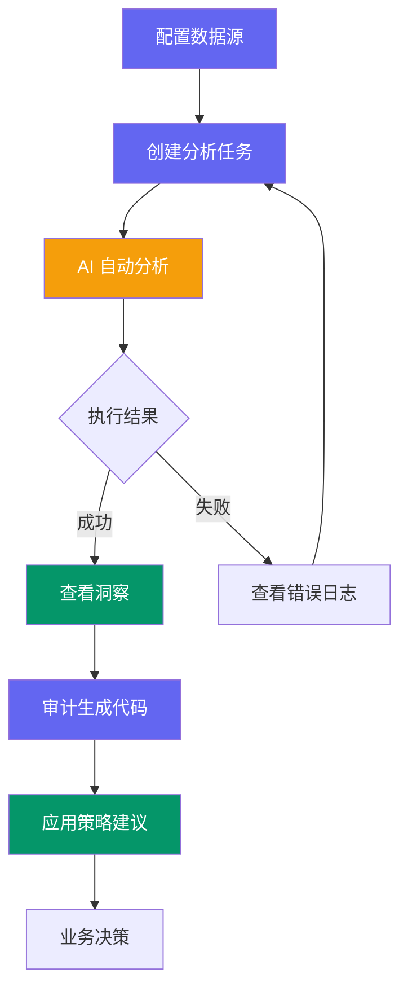
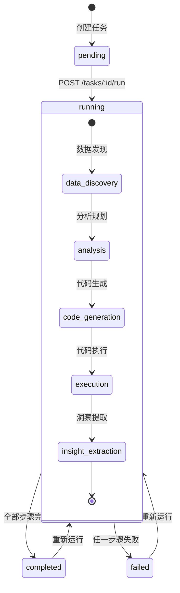

# 业务流转

## 用户角色

| 角色 | 典型操作 | 关注点 |
|------|----------|--------|
| 业务分析师 | 创建任务、查看洞察、应用策略 | 数据驱动决策，快速获取业务洞察 |
| 产品经理 | 定义业务目标、评估策略效果 | 用户行为分析，增长策略 |
| 数据工程师 | 配置数据源、审计生成代码 | 数据安全、SQL 质量、执行性能 |

## 端到端流程

## 页面与路由

| 路由 | 页面 | 功能说明 |
|------|------|----------|
| `/overview` | 概览 | KPI 卡片、任务趋势、状态分布、最近任务 |
| `/tasks` | 任务列表 | 表格展示、状态筛选、关键词搜索、重跑 |
| `/tasks/new` | 新建任务 | 三步向导：选数据源 → 写目标 → 确认提交 |
| `/tasks/:id` | 任务详情 | 元信息、五步管线进度、6 个结果 Tab |
| `/datasources` | 数据源管理 | 卡片列表、新建/编辑/删除/测试连接 |
| `/insights` | 洞察聚合 | 按业务目标分组展示所有已完成任务的洞察 |
| `/settings` | 设置 | 团队切换、主题选择、API 状态、关于信息 |

## 任务状态机

## 核心数据模型

### Task（任务）

| 字段 | 类型 | 说明 |
|------|------|------|
| task_id | string | 唯一标识 |
| team_id | string | 所属团队 |
| status | TaskStatus | pending / running / completed / failed |
| business_doc | string | 业务文档（最长 5000 字） |
| business_goal | string | 业务目标（最长 500 字） |
| created_at | ISO 8601 | 创建时间 |
| updated_at | ISO 8601 | 更新时间 |

### AnalysisResult（分析结果）

任务完成后，`GET /tasks/:id/result` 返回完整分析结果，包含 6 个子模型：

| 子模型 | 说明 |
|--------|------|
| data_dict | 数据字典：表清单、字段详情、表关系 |
| analysis_plan | 分析计划：指标、步骤 |
| generated_code | 生成的 SQL/Python 代码 |
| execution_result | 执行结果：输出、日志、耗时 |
| insights | 洞察列表：标题、描述、置信度、数据支撑、潜在影响 |
| strategies | 策略建议：目标人群、触发条件、预期效果、风险评估 |

### DataSource（数据源）

| 字段 | 类型 | 说明 |
|------|------|------|
| id | string | 唯一标识 |
| type | postgresql / mysql / clickhouse / bigquery | 数据库类型 |
| host | string | 主机地址 |
| port | number | 端口 |
| database | string | 数据库名 |
| status | active / inactive | 连接状态 |

## 主题系统

| 主题 ID | 名称 | 模式 | 主色调 |
|---------|------|------|--------|
| sunrise | 晨曦 | 浅色 | 琥珀橙 #F59E0B |
| **aurora** | **极光** | **浅色** | **靛蓝紫 #6366F1** |
| midnight | 子夜 | 深色 | 金色 #FBBF24 |
| forest | 林语 | 浅色 | 翡翠绿 #059669 |

> 默认主题为 **aurora（极光）**，用户可在设置页或顶栏随时切换，所有 UI 组件和图表即时跟随。

## 开发环境 Mock

开发时启用 MSW 拦截 `/api/v1/*` 请求，提供：

- 任务列表与详情（含状态自动流转：创建 15s 后自动完成）
- 数据源 CRUD（测试连接 90% 成功率）
- 洞察数据（含漏斗图、柱状图、饼图示例）

启用方式：`.env.development` 中 `VITE_ENABLE_MOCK=true`
