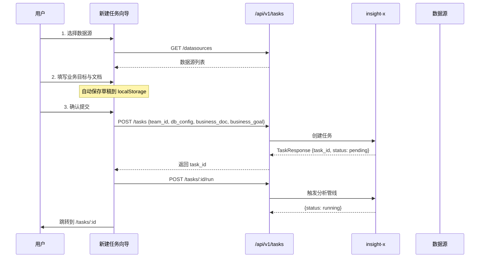
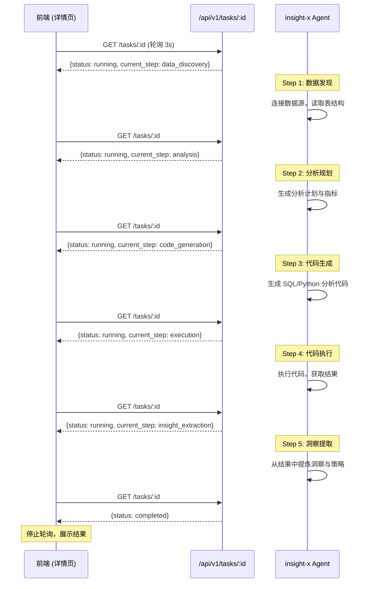
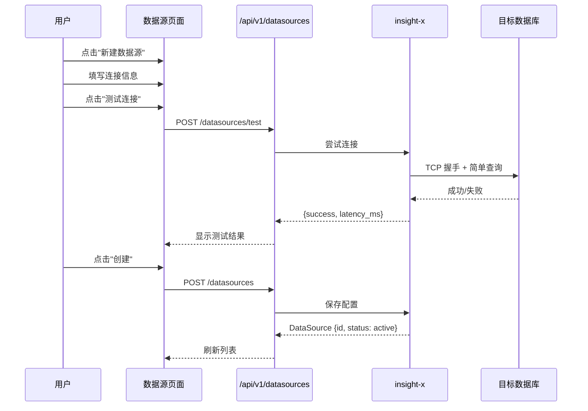
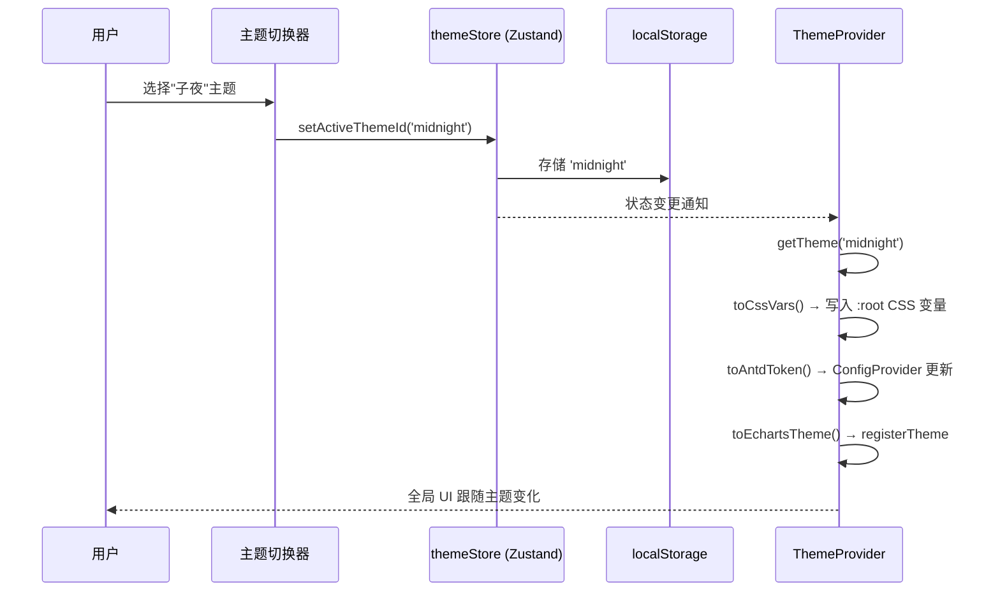

# 时序图

## 任务创建流程

用户通过三步向导提交分析任务，后端 Agent 接收后异步执行。

```mermaid
sequenceDiagram
    participant U as 用户
    participant W as 新建任务向导
    participant API as /api/v1/tasks
    participant BE as insight-x
    participant D as 数据源

    U->>W: 1. 选择数据源
    W->>API: GET /datasources
    API-->>W: 数据源列表
    U->>W: 2. 填写业务目标与文档
    Note over W: 自动保存草稿到 localStorage
    U->>W: 3. 确认提交
    W->>API: POST /tasks {team_id, db_config, business_doc, business_goal}
    API->>BE: 创建任务
    BE-->>API: TaskResponse {task_id, status: pending}
    API-->>W: 返回 task_id
    W->>API: POST /tasks/:id/run
    API->>BE: 触发分析管线
    BE-->>API: {status: running}
    W->>U: 跳转到 /tasks/:id
```

## 任务执行管线

后端 Agent 按五步管线执行，前端通过轮询获取进度。

```mermaid
sequenceDiagram
    participant FE as 前端 (详情页)
    participant API as /api/v1/tasks/:id
    participant BE as insight-x Agent

    FE->>API: GET /tasks/:id (轮询 3s)
    API-->>FE: {status: running, current_step: data_discovery}

    Note over BE: Step 1: 数据发现
    BE->>BE: 连接数据源，读取表结构
    FE->>API: GET /tasks/:id
    API-->>FE: {status: running, current_step: analysis}

    Note over BE: Step 2: 分析规划
    BE->>BE: 生成分析计划与指标
    FE->>API: GET /tasks/:id
    API-->>FE: {status: running, current_step: code_generation}

    Note over BE: Step 3: 代码生成
    BE->>BE: 生成 SQL/Python 分析代码
    FE->>API: GET /tasks/:id
    API-->>FE: {status: running, current_step: execution}

    Note over BE: Step 4: 代码执行
    BE->>BE: 执行代码，获取结果
    FE->>API: GET /tasks/:id
    API-->>FE: {status: running, current_step: insight_extraction}

    Note over BE: Step 5: 洞察提取
    BE->>BE: 从结果中提炼洞察与策略
    FE->>API: GET /tasks/:id
    API-->>FE: {status: completed}
    Note over FE: 停止轮询，展示结果
```

## 数据源管理流程

```mermaid
sequenceDiagram
    participant U as 用户
    participant Page as 数据源页面
    participant API as /api/v1/datasources
    participant BE as insight-x
    participant DB as 目标数据库

    U->>Page: 点击"新建数据源"
    U->>Page: 填写连接信息
    U->>Page: 点击"测试连接"
    Page->>API: POST /datasources/test
    API->>BE: 尝试连接
    BE->>DB: TCP 握手 + 简单查询
    DB-->>BE: 成功/失败
    BE-->>API: {success, latency_ms}
    API-->>Page: 显示测试结果

    U->>Page: 点击"创建"
    Page->>API: POST /datasources
    API->>BE: 保存配置
    BE-->>API: DataSource {id, status: active}
    API-->>Page: 刷新列表
```

## 主题切换流程

```mermaid
sequenceDiagram
    participant U as 用户
    participant SW as 主题切换器
    participant Store as themeStore (Zustand)
    participant LS as localStorage
    participant TP as ThemeProvider

    U->>SW: 选择"子夜"主题
    SW->>Store: setActiveThemeId('midnight')
    Store->>LS: 存储 'midnight'
    Store-->>TP: 状态变更通知

    TP->>TP: getTheme('midnight')
    TP->>TP: toCssVars() → 写入 :root CSS 变量
    TP->>TP: toAntdToken() → ConfigProvider 更新
    TP->>TP: toEchartsTheme() → registerTheme
    TP-->>U: 全局 UI 跟随主题变化
```
